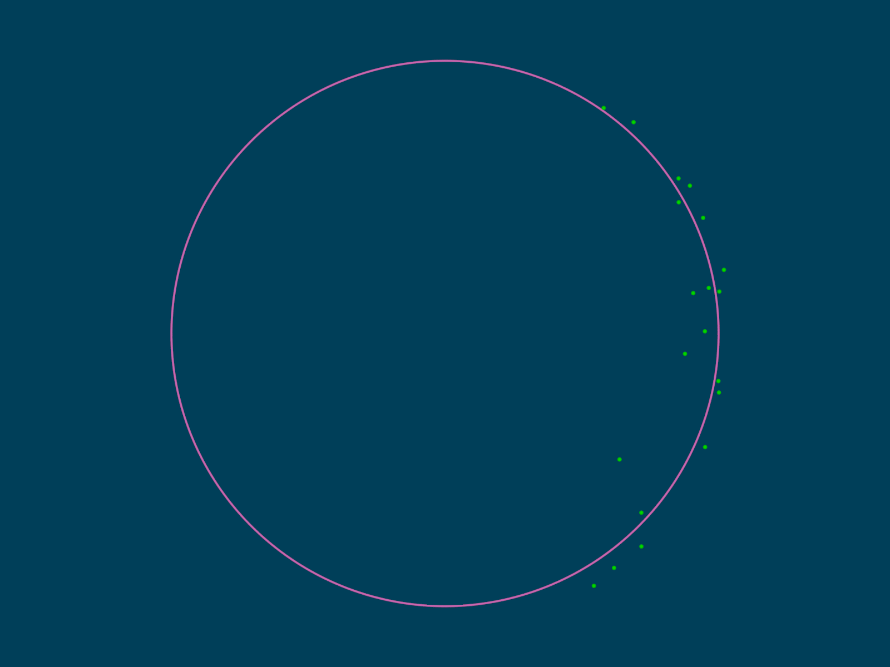

# POV-Ray-matrices
POV-Ray v3.7 include file for working with matrices

All rotation matrices created with this library maintain consistency with POV-Ray's left-handed coordinate system convention.

NB: At the moment this library is Work In Progress, so it is not yet complete and things may suddenly change.

See also https://en.wikipedia.org/wiki/Matrix_(mathematics)

## Image created with one of the examples:

### Fit circle to points
[Source code](MoreExamples/FitCircleToPoints.pov)\

## M_NoOfRows(AA)
[Example(s)](EXAMPLES.md#m_noofrowsaa)

## M_NoOfCols(AA)
[Example(s)](EXAMPLES.md#m_noofcolsaa)

## M_CustomStr(AA, Length, Precision, ExtraIndentStr, Compact)
[Example(s)](EXAMPLES.md#m_customstraa-length-precision-extraindentstr-compact)

## M_Str(AA)
[Example(s)](EXAMPLES.md#m_straa)

## M_CustomPrint(AA, Length, Precision, ExtraIndentStr, Compact)
[Example(s)](EXAMPLES.md#m_customprintaa-length-precision-extraindentstr-compact)

## M_Print(AA)
[Example(s)](EXAMPLES.md#m_printaa)

## M_Zeros(NoOfRows, NoOfCols)
[Example(s)](EXAMPLES.md#m_zerosnoofrows-noofcols)

## M_Ones(NoOfRows, NoOfCols)
[Example(s)](EXAMPLES.md#m_onesnoofrows-noofcols)

## M_Full(NoOfRows, NoOfCols, Const)
[Example(s)](EXAMPLES.md#m_fullnoofrows-noofcols-const)

## M_Identity(Size)
[Example(s)](EXAMPLES.md#m_identitysize)

## M_Neg(AA)
[Example(s)](EXAMPLES.md#m_negaa)

## M_Pos(AA)
[Example(s)](EXAMPLES.md#m_posaa)

## M_Scale(AA, Scale)
[Example(s)](EXAMPLES.md#m_scaleaa-scale)

## M_Round(AA, N)
[Example(s)](EXAMPLES.md#m_roundaa-n)

## M_ApplyCheckerSigns(AA)
[Example(s)](EXAMPLES.md#m_applycheckersignsaa)

## M_ScaleRow(AA, RowNo, Scale)
[Example(s)](EXAMPLES.md#m_scalerowaa-rowno-scale)

## M_ScaleCol(AA, ColNo, Scale)
[Example(s)](EXAMPLES.md#m_scalecolaa-colno-scale)

## M_SwapRows(AA, RowNo, Row_No)
[Example(s)](EXAMPLES.md#m_swaprowsaa-rowno-row_no)

## M_SwapCols(AA, ColNo, Col_No)
[Example(s)](EXAMPLES.md#m_swapcolsaa-colno-col_no)

## M_Add(AA, BB)
[Example(s)](EXAMPLES.md#m_addaa-bb)

## M_Sub(AA, BB)
[Example(s)](EXAMPLES.md#m_subaa-bb)

## M_Trace(AA)
[Example(s)](EXAMPLES.md#m_traceaa)

## M_Transpose(AA)
[Example(s)](EXAMPLES.md#m_transposeaa)

## M_Mult(AA, BB)
[Example(s)](EXAMPLES.md#m_multaa-bb)

## M_Gramian(AA)
[Example(s)](EXAMPLES.md#m_gramianaa)

## M_DelRow(AA, RowNo)
[Example(s)](EXAMPLES.md#m_delrowaa-rowno)

## M_DelCol(AA, ColNo)
[Example(s)](EXAMPLES.md#m_delcolaa-colno)

## M_DelRowAndCol(AA, RowNo, ColNo)
[Example(s)](EXAMPLES.md#m_delrowandcolaa-rowno-colno)

## M_AddScaledRowToRow(AA, Scale, RowNo, ToRowNo)
[Example(s)](EXAMPLES.md#m_addscaledrowtorowaa-scale-rowno-torowno)

## M_AddScaledColToCol(AA, Scale, ColNo, ToColNo)
[Example(s)](EXAMPLES.md#m_addscaledcoltocolaa-scale-colno-tocolno)

## M_SubMatrix(AA, RowNo, NoOfRows, ColNo, NoOfCols)
[Example(s)](EXAMPLES.md#m_submatrixaa-rowno-noofrows-colno-noofcols)

## M_Stack(AAAA)
[Example(s)](EXAMPLES.md#m_stackaaaa)

## M_Det_SS(AA)
[Example(s)](EXAMPLES.md#m_det_ssaa)

## M_Det(AA)
[Example(s)](EXAMPLES.md#m_detaa)

## M_Minors(AA)
[Example(s)](EXAMPLES.md#m_minorsaa)

## M_Cofactors(AA)
[Example(s)](EXAMPLES.md#m_cofactorsaa)

## M_Adjoint(AA)
[Example(s)](EXAMPLES.md#m_adjointaa)

## M_Inv_SS(AA)
[Example(s)](EXAMPLES.md#m_inv_ssaa)

## M_Inv(AA)
[Example(s)](EXAMPLES.md#m_invaa)

## M_PseudoInv(AA)
[Example(s)](EXAMPLES.md#m_pseudoinvaa)

## M_FromTransformFn(TransformFn)
[Example(s)](EXAMPLES.md#m_fromtransformfntransformfn)

## M_ToTransformFn(AA)
[Example(s)](EXAMPLES.md#m_totransformfnaa)

## M_FromTransform(Transform)
[Example(s)](EXAMPLES.md#m_fromtransformtransform)

## M_ToTransform(AA)
[Example(s)](EXAMPLES.md#m_totransformaa)

## M_Row_FromPos2D(p0)
[Example(s)](EXAMPLES.md#m_row_frompos2dp0)

## M_Col_FromPos2D(p0)
[Example(s)](EXAMPLES.md#m_col_frompos2dp0)

## M_Row_FromDir2D(v0)
[Example(s)](EXAMPLES.md#m_row_fromdir2dv0)

## M_Col_FromDir2D(v0)
[Example(s)](EXAMPLES.md#m_col_fromdir2dv0)

## M_Row_FromPos3D(p0)
[Example(s)](EXAMPLES.md#m_row_frompos3dp0)

## M_Col_FromPos3D(p0)
[Example(s)](EXAMPLES.md#m_col_frompos3dp0)

## M_Row_FromDir3D(v0)
[Example(s)](EXAMPLES.md#m_row_fromdir3dv0)

## M_Col_FromDir3D(v0)
[Example(s)](EXAMPLES.md#m_col_fromdir3dv0)

## M_SkewSym_FromDir3D(v0)
[Example(s)](EXAMPLES.md#m_skewsym_fromdir3dv0)

## M_Pos2D_FromRow(AA, RowNo)
[Example(s)](EXAMPLES.md#m_pos2d_fromrowaa-rowno)

## M_Pos2D_FromCol(AA, ColNo)
[Example(s)](EXAMPLES.md#m_pos2d_fromcolaa-colno)

## M_Dir2D_FromRow(AA, RowNo)
[Example(s)](EXAMPLES.md#m_dir2d_fromrowaa-rowno)

## M_Dir2D_FromCol(AA, ColNo)
[Example(s)](EXAMPLES.md#m_dir2d_fromcolaa-colno)

## M_Pos3D_FromRow(AA, RowNo)
[Example(s)](EXAMPLES.md#m_pos3d_fromrowaa-rowno)

## M_Pos3D_FromCol(AA, ColNo)
[Example(s)](EXAMPLES.md#m_pos3d_fromcolaa-colno)

## M_Dir3D_FromRow(AA, RowNo)
[Example(s)](EXAMPLES.md#m_dir3d_fromrowaa-rowno)

## M_Dir3D_FromCol(AA, ColNo)
[Example(s)](EXAMPLES.md#m_dir3d_fromcolaa-colno)

## M_FromRowVectors2D(vU, vV, pT)
[Example(s)](EXAMPLES.md#m_fromrowvectors2dvu-vv-pt)

## M_FromColVectors2D(vU, vV, pT)
[Example(s)](EXAMPLES.md#m_fromcolvectors2dvu-vv-pt)

## M_FromRowVectors3D(vX, vY, vZ, pT)
[Example(s)](EXAMPLES.md#m_fromrowvectors3dvx-vy-vz-pt)

## M_FromColVectors3D(vX, vY, vZ, pT)
[Example(s)](EXAMPLES.md#m_fromcolvectors3dvx-vy-vz-pt)

## M_Translate2D(pT)
[Example(s)](EXAMPLES.md#m_translate2dpt)

## M_Scale2D(vS)
[Example(s)](EXAMPLES.md#m_scale2dvs)

## M_Rotate2D(Angle)
[Example(s)](EXAMPLES.md#m_rotate2dangle)

## M_Translate3D(pT)
[Example(s)](EXAMPLES.md#m_translate3dpt)

## M_Scale3D(vS)
[Example(s)](EXAMPLES.md#m_scale3dvs)

## M_Rotate3D_AroundX(Angle)
[Example(s)](EXAMPLES.md#m_rotate3d_aroundxangle)

## M_Rotate3D_AroundY(Angle)
[Example(s)](EXAMPLES.md#m_rotate3d_aroundyangle)

## M_Rotate3D_AroundZ(Angle)
[Example(s)](EXAMPLES.md#m_rotate3d_aroundzangle)

## M_Rotate3D_AroundAxis(vAxis, Angle)
[Example(s)](EXAMPLES.md#m_rotate3d_aroundaxisvaxis-angle)

## M_Reorient3D(vFrom, vTo)
[Example(s)](EXAMPLES.md#m_reorient3dvfrom-vto)
